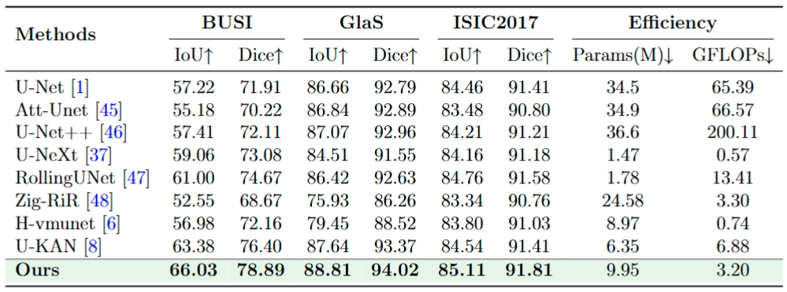

# MED-Net

## 0. Abstract

With the widespread application of the Kolmogorov-Arnold Network (KAN) framework in computer vision, KAN-based models have made remarkable progress in the field of medical image segmentation. However, these models do not always outperform models based on convolutional neural networks or Mamba. This limitation mainly stems from the fact that most existing KAN-based studies tend to focus on a single visual encoding strategy, while ignoring the advantages of integrating multiple visual encoding strategies. Secondly, most existing methods use max pooling and average pooling operations, which can effectively compress feature dimensions but are prone to losing rich contextual information due to only focusing on local extreme values or global averages. To address these challenges, we propose a new framework called MED-Net, which contains multiple visual encoding strategies and Manhattan distance-based pooling operations. This design makes full use of different encoding strategies and helps to extract comprehensive visual features. In addition, the proposed Manhattan-distance pooling uses reparameterized sorting and linear rank weighting to improve the contextual expression ability of the network without additional learnable parameters. Comprehensive experiments on three public benchmark datasets, BUSI, GlaS, and ISIC2017, show that our approach consistently outperforms the state-of-the-art methods on multiple evaluation metrics, demonstrating its robustness and effectiveness in addressing key segmentation challenges. For reproduction, the implementation codes can be checked out at https://github.com/szz2025/MED-Net.


## 1. Overview

<div align="center">

</div>


## 2. Main Environments

The environment installation process can be carried out as follows:

```
conda create -n MED-Net python=3.8
conda activate MED-Net
pip install torch==1.13.0 torchvision==0.14.0 torchaudio==0.13.0 
pip install packaging
pip install timm==0.4.12
pip install pytest chardet yacs termcolor
pip install submitit tensorboardX
pip install triton==2.0.0
pip install causal_conv1d==1.0.0  
pip install mamba_ssm==1.0.1
pip install scikit-learn matplotlib thop h5py SimpleITK scikit-image medpy yacs
```


## 3. Datasets

BUSI: The dataset can be found [here](https://www.kaggle.com/datasets/aryashah2k/breast-ultrasound-images-dataset) .

Glas: The dataset can be found [here](https://websignon.warwick.ac.uk/origin/slogin?shire=https%3A%2F%2Fwarwick.ac.uk%2Fsitebuilder2%2Fshire-read&providerId=urn%3Awarwick.ac.uk%3Asitebuilder2%3Aread%3Aservice&target=https%3A%2F%2Fwarwick.ac.uk%2Ffac%2Fcross_fac%2Ftia%2Fdata%2Fglascontest&status=notloggedin) .

ISIC2017: The dataset can be found [here](https://challenge.isic-archive.com/data/) .


## 4. Train the MED-Net

```
python train.py
```


## 5. Test the MED-Net 

First, in the test.py file, you should change the address of the checkpoint in 'resume_model'.

```
python test.py
```


## 6. Comparison With State of the Arts

The performance of the proposed method is compared with the state-of-the-art models on the ISIC2017, ISIC2018, and $\text{PH}^2$ datasets, with the top two results highlighted in red and blue, respectively.

<div align="center">

</div>


## 7. Acknowledgement

Thanks to [U-KAN](https://github.com/Zhaoyi-Yan/U-KAN) for their outstanding works.
